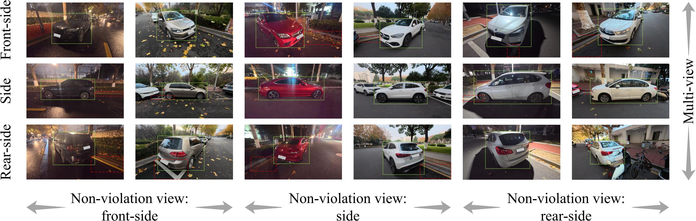
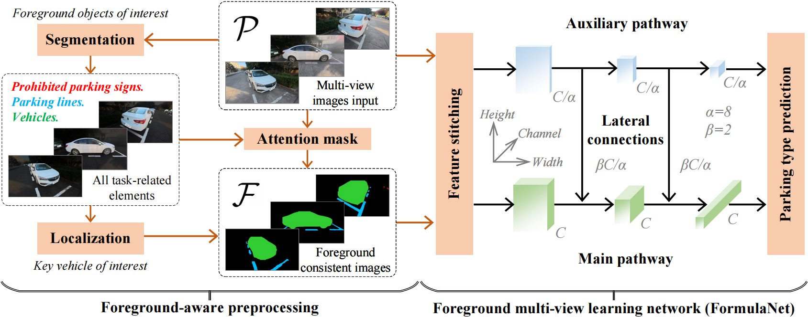

  
  *A brief illustration of challenges in single-view methods for accurate detection of illegally parked vehicles. The displayed vehicles are all illegally parked. For clarity, we use bboxes of different colors for key vehicles (light green solid lines), and visual cues related to violations (red dashed lines). Environmental factors such as occlusion or lighting may sometimes obstruct the determination of violation under certain viewing angles.*
  

# The MVIPD Dataset

This is the dataset and code for manuscript

***Foreground Multi-View Learning for Robust Parking Violation Detection***. 

(Pre-submitted to *Information Fusion*)

✨ *6k high-quality images from mobile perspectives.* ✨

🌟 *49k foreground instance segmentation annotations.* 🌟

💡 *Three-side view information for each key vehicle.* 💡

# Overview

- We introduce *MVIPD*, a multi-view dataset with instance-level annotations for parking violation detection. It supports automated enforcement applications in intelligent transportation systems.

- We propose a foreground multi-view learning method for illegal parking detection, which enables comprehensive and accurate understanding of vehicle parking patterns.

  
  ***Overview of the parking violation detection process, structured in two stages.***
  *The first stage segments foreground elements and localizes key vehicles across multiple views, generating consistent feature representations. The second stage employs a dual-path network to jointly learn from raw and processed inputs for parking type classification.*

# Update Notification

- *Jul 3, 2025* All foreground consistent images can be downloaded from Baidu Cloud and Google Cloud.

- We plan to make all original images and foreground mask annotations open source after the paper is accepted.

# The Multi-View Illegal Parking Detection (MVIPD) dataset

## Dataset Introduction

- The *MVIPD* dataset comprises 6k images captured from three lateral viewpoints. Each image centers on a **key vehicle**, for which three synchronized images—one from each viewpoint—are collected, yielding 2k unique key vehicles.

- Data was collected between December 2024 and March 2025 using a DJI Osmo Action 5 Pro camera. The dataset captures real-world urban parking conditions in Qixia District, Nanjing, China.

- All images adopt a 16:9 aspect ratio and were corrected for lens distortion during post-processing. Both daytime and nighttime scenes were included to ensure illumination diversity.

## Dataset Annotations

The annotation process of our dataset is shown in shown below and consists of two stages: **image-level annotation** and **instance-level annotation**.

  
  ***Annotation process of the MVIPD dataset.***
  *For each key vehicle, three views are consistently annotated with metadata. Instance-level masks are provided for all foreground elements relevant to illegal parking detection. Different colors are used in the visualization to distinguish between foreground categories.*

**Image-Level Annotation.** Each key vehicle is annotated across three lateral-view images. Each image is associated with a unified metadata tuple $(V^k, S^k, I^k, C^k)$.

Here, $V^k$ denotes the key vehicle ID ($k \in [1, 2000]$), $S^k \in [1, 10]$ is the scene ID, $I^k \in \{1, 2, 3\}$ indicates the illumination condition (1 = nighttime, 2 = low-light daytime, 3 = clear daytime), and $C^k \in \{C_1, C_2, C_3\}$ represents the parking category. The metadata remains consistent across all three views corresponding to the same key vehicle.

**Instance-Level Annotation.** Foreground elements related to illegal parking are annotated using pixel-level instance masks on the Roboflow platform. The annotated categories include:

- Four-wheeled vehicles.
- Parking lines.
- Prohibited parking signs. This includes features such as yellow solid lines, grid areas, no-parking signs, zebra crossings, and fire lanes, etc.

## Evaluation Criteria

To evaluate the **scene generalization capability** of parking violation detection models, we establish a **cross-scene validation benchmark**. The *MVIPD* dataset was collected from ten distinct scenes ($S_1-S_{10}$). Based on scene IDs, we assign $S_1$, $S_3$, $S_4$, $S_5$, $S_7$, and $S_9$ to the training set, and use $S_2$, $S_6$, $S_8$, and $S_{10}$ as the testing set. 

To comprehensively evaluate the proposed method, we introduce a two-stage evaluation protocol based on multi-view spatial overlap and classification correctness. We first define a **set intersection over union (*SIoU*)** metric to assess localization quality across all views. Given a predicted mask $\hat{M}$ and the ground truth mask $M$ of a key vehicle over views in $\mathcal{P}^k$, localization is deemed successful only if the spatial \textit{IoU} in \textbf{every} view exceeds a predefined threshold $\tau$, ensuring per-view consistency.

Besides, a more holistic evaluation is provided by the overall accuracy metric. Accuracy reflects the proportion of testing samples that are both correctly localized (*i.e.*, *SIoU* $> \tau$ in all views) and correctly classified

You can find the details of the above evaluation metrics in the manuscript.

# Foreground-Aware Preprocessing

To enhance robustness across diverse scenarios, we introduce a foreground-aware preprocessing strategy that preserves semantically relevant components in the input images. These foreground objects include *prohibited parking signs*, *parking lines*, and *vehicles*. This process suppresses background clutter and retains a consistent representation to facilitate downstream classification. 

You need to execute the following code to complete this step：

`python foreground_aware_preprocessing.py`

The pre-trained **instance segmentation model** (yolov11/v11n/best.pt) can be directly used for reproduction.

Also, you can **skip this step** by downloading the **data**  (55.9MB) we preprocessed earlier. [Baidu Cloud](https://pan.baidu.com/s/188399vyonhNPxNDXDcqREg?pwd=bwsm) / [Google Cloud](https://drive.google.com/file/d/1Xt8U2kuxu6Nw9obt6wPQomeUodEQRrqo/view?usp=sharing)

# FormulaNet for Multi-View Learning

After completing the preprocessing, the main program can be called for training and testing.

You need to execute the following code to complete this step：

`python main_single_stream.py`   # Currently available for training and testing single-stream classification models.

`python main_formulanet.py`      # Available after we fully open source the original images.

# Contact

Any questions, feel free to contact me via email: `zeshenghu@njnu.edu.cn`

# Acknowledgments

***We would like to express our sincere gratitude to the following individuals and groups for their invaluable assistance in this work:***

🧡 **- The officers at Nanjing Transport for their valuable guidance and support throughout this work.**

🧡 **- Potential contributors, including reviewers and researchers, for their interest and input in this work.**

